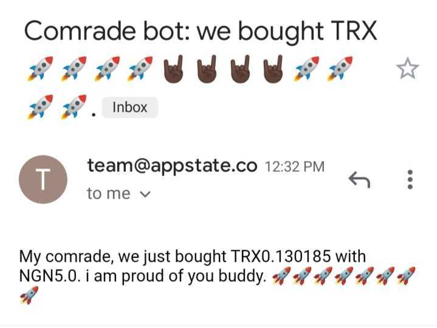

# Quidax DCA bot
This bot automatically buys crypto on your behalf on [Quidax](https://quidax.com) using their API while you sit back, relax and enjoy a cold one. you can check out [Quidax developer api](https://docs.quidax.com/docs) 



## What you need
- A Quidax account and your API secret key, get your secret key from **Account Settings > Developer Settings**.
- A Sendgrid account ready with your domain & it's secret - *optional* 
## Features

- Scheduling
- Email notifications
- Out of the box support for Heroku deployment

## Configuration options
| Property             | Description                                                                                                      | Required                                                   |
|----------------------|------------------------------------------------------------------------------------------------------------------|------------------------------------------------------------|
| `quidax_secret`      | Your Quidax API secret, you can find it under **Developer Settings**                                             | YES                                                        |
| `sendgrid_api_key`     | Your Sendgrid API key, you can find it in your **Domain's settings**                                              | NO. if omitted, the bot will not send email notifications. |                                                      |
| `sending_email` | Sender's address for the notification email. ex, `bot@SENDGRID_DOMAIN`                                       | Yes, if using Sendgrid.                                     |
| `recieving_email`   | Your email address.                                                                                              | Yes, if using Sendgrid                                      |
| `markets`             | An array containing the assests you want, and their currency pairs.  See the order object table for more information. | Yes                                                        |

### Order object
| Property               | Description                                                                                                                                                                                                                                                                          | Required                                         |
|------------------------|--------------------------------------------------------------------------------------------------------------------------------------------------------------------------------------------------------------------------------------------------------------------------------------|--------------------------------------------------|
| `asset`                | What crypto you would like to buy. Allowed values:`btc/ngn`, `trx/ngn`, `eth/ngn`, `usdt/ngn`.                                                                                                                                                                                        | Yes                                              |
| `currency`             | What you want to make the purchase with. Allowed values: `ngn`, `ghs`, `usdt`.                                                                                                                                                                                                       | Yes                                              |
| `amount` | Use `amount` to buy the value worth of the specified currency (1,0000 ngn worth of eth). **Note**: Quidax does have a minimum and maximum threshold for orders.                             | Yes. but only one should be speicified per order |
| `schedule`             | `day_of_week` days that the bot will run, `hour` what hour of the day would it bot run, `minute` what minute the bot will run, `timezone` the timezone you want the bot to run | NO, but it is recommended                        |

## Usage/Examples

To use this bot, here are the steps you need to take:

- Clone the repo to your machine
    ```bash
    git clone https://github.com/oyeolamilekan/quidax-dca-bot-python && cd quidax-dca-bot-python
    ```
- You would have to create a virtual environment
    ```
    pipenv shell
    ```
- Install the dependencies using pipenv (sorry pip lovers 🥲 )
    ```
    pipenv install
    ```

- Run the bot with the following command.
    ```
    python -m src.buy
    ```

## Environment variables
This app uses environment variables, duplicate and rename the `.env.example` to `.env` and set the values. You may also need to set these variables on your cloud provider, depending on how you choose to deploy. the most important variable is the `QUIDAX_SECRET_KEY`

